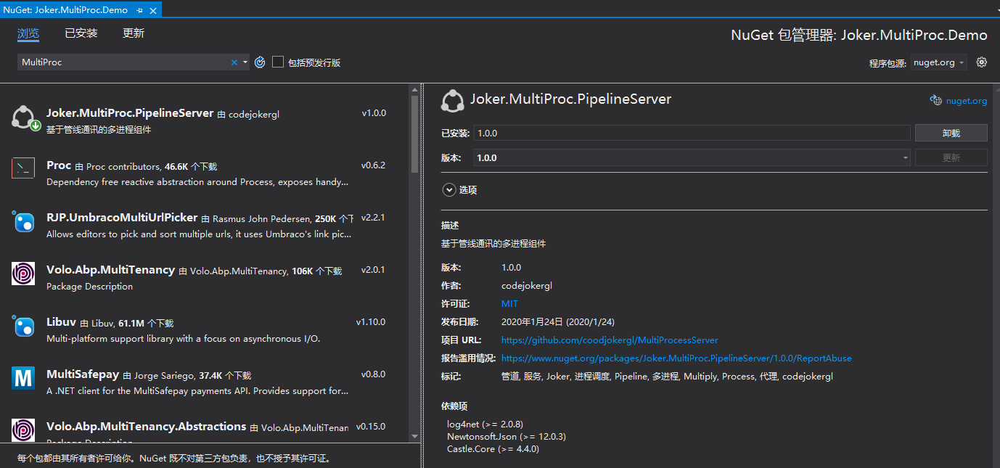

# MultiProcessServer

一个基于PipelineServer管道通信的多进程服务

## 如何获取已发布版本

打开`Visual Studio` 工具，Nuget包管理搜索`MultiProc`关键字，下载安装使用。


## 如何使用

### 1.程序集依赖

```Csharp
[assembly:ProcessPluginServer]
```

```text
注意：如果子进程服务程序是内部(internal)的，需要打特性[assembly:InternalsVisibleTo( Joker.MultiProc.PipelineServer.InternalsVisible.ToLocalMethodDescription)]
```

### 2.如何声明多进程服务

```Csharp
    /// <summary>
    /// 计算器-接口
    /// </summary>
    [MultiProcess(typeof(Calculator), "计算器服务", 1)]
    public interface ICalculator : Joker.MultiProc.PipelineServer.ProcessService.IProcessService
    {
        /// <summary>
        /// 求和
        /// </summary>
        /// <param name="a"></param>
        /// <param name="b"></param>
        /// <returns></returns>
        int Sum(int a, int b);
    }
```

### 3.如何定义多进程服务

```Csharp
    /// <summary>
    /// 计算器
    /// </summary>
    public class Calculator:ICalculator
    {
        /// <inheritdoc cref="Sum"/>
        public virtual int Sum(int a, int b)
        {
            Console.WriteLine(ProcessEnvironment.IsDebug);
            return a + b;
        }
    }
```

### 4.如何使用进程服务

```Csharp
    //获取计算器
    var calc = new ProcessService<ICalculator>();
    var result = Calc.Instance.Sum(100, 200;
    Console.WriteLine(result);
```

## 交流

邮箱:
<mrgonglei159@gmail.com>
<595459062@qq.com>
